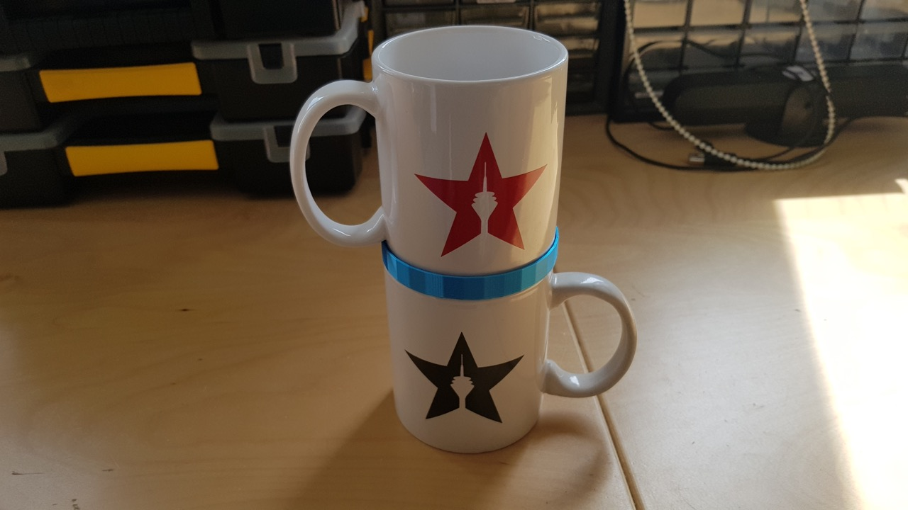
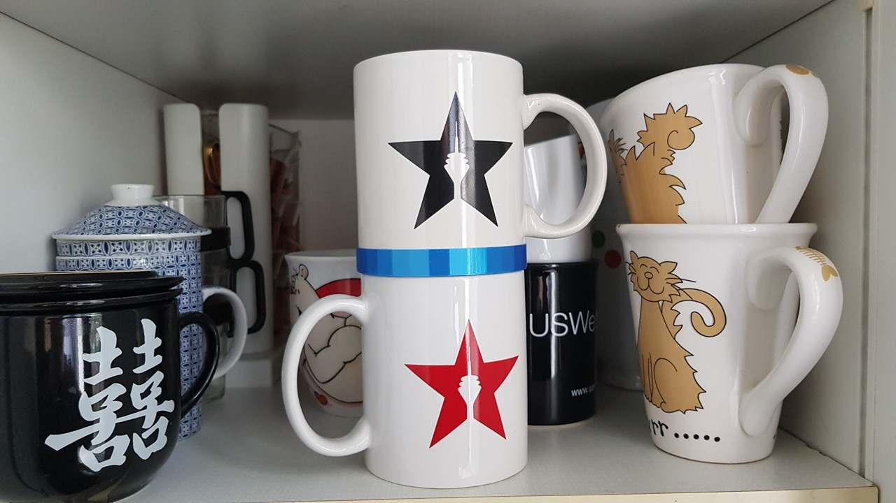

# scad-cup-stack
The cup organizer helps you to stack cups securely. 
You can use the customizer to set the diameters of your cups.

## Pictures

## Print Settings

<dl>
  <dt>Supports:<dt>
  <dd>Yes</dd>
  <dt>Resolution:</dt>
  <dd>0.2</dd>
  <dt>Infill:</dt>
  <dd>20%</dd>
</dl>
