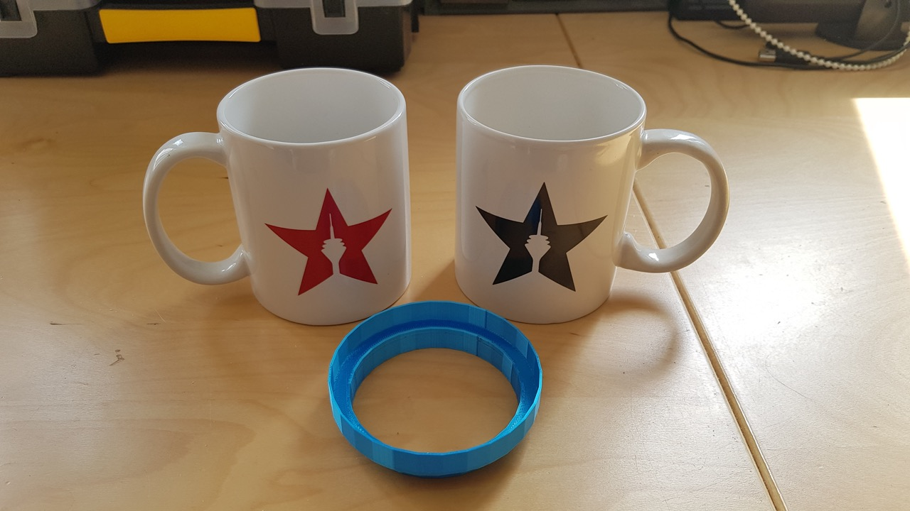
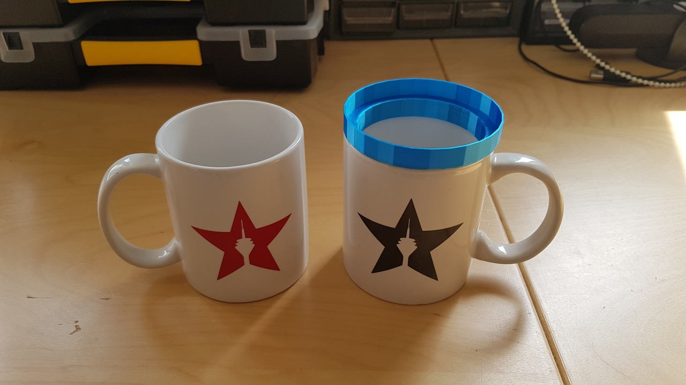

# scad-cup-stack
The cup organizer helps you to stack cups securely. 
You can use the customizer to set the diameters of your cups.

## Pictures

## Use OpenSCAD

1. **Download and install:** [OpenSCAD](http://openscad.org/) version 2021.01 or newer
2. **Download:** The *.scad file of this model.
3. **Start** OpenSCAD and **open** the *.scad file in it.
4. **Open the customizer** via the menu "Window/Customizer"

Now you can configure the model and use the `F5` key to render the preview of your changes.

### Export your STL file

If you're done with your model settings, you can export the STL file:

1. Render the mesh by pressing the `F6` key.
2. Wait until the rendering is finished. This might take some minutes.
3. Export the STL file by pressing the `F7` key.

### Optionally save your configuration

If you like to use your configuration as a template for further models, it's a good idea, to save your configuration:

1. Click the `+` symbol in the customizer, which you find beside the configuration selector drop-down in the second line of the customizer.
2. Give your configuration a name.

Use the drop-down menu to access your saved configurations.

## Print Settings

<dl>
  <dt>Supports:<dt>
  <dd>Yes</dd>
  <dt>Resolution:</dt>
  <dd>0.2</dd>
  <dt>Infill:</dt>
  <dd>20%</dd>
</dl>
